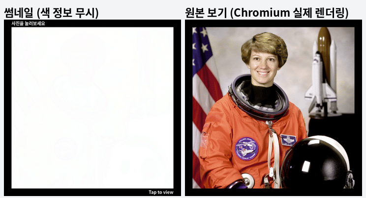
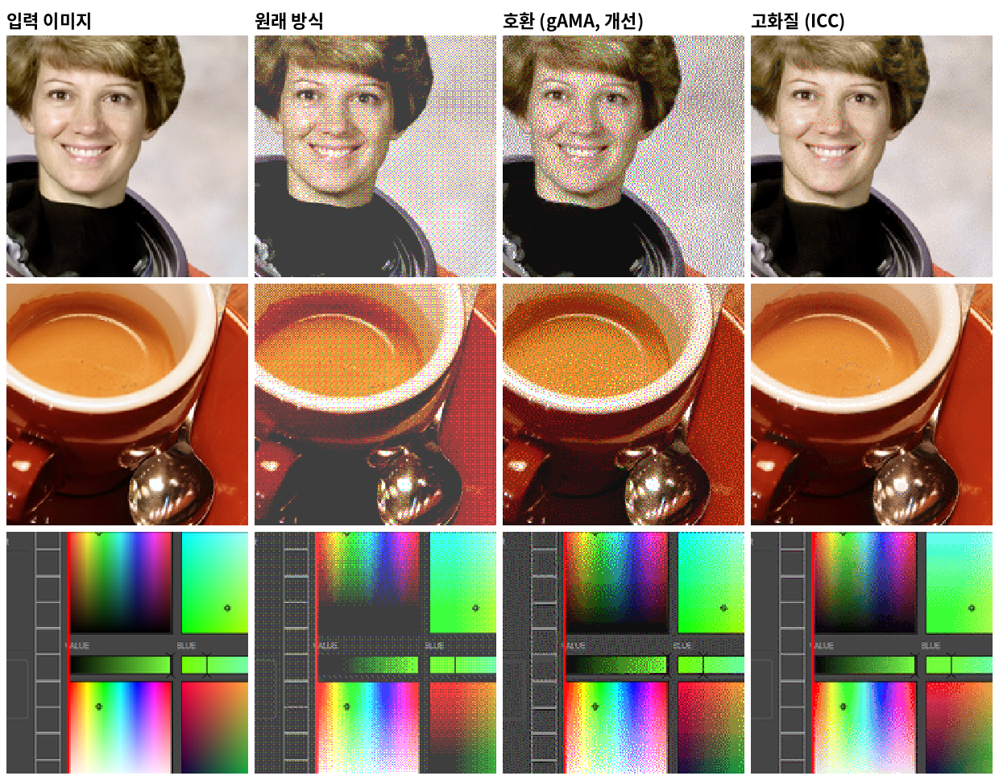
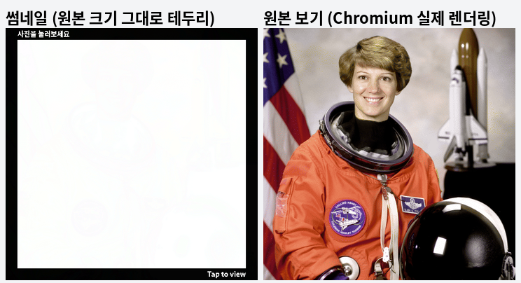
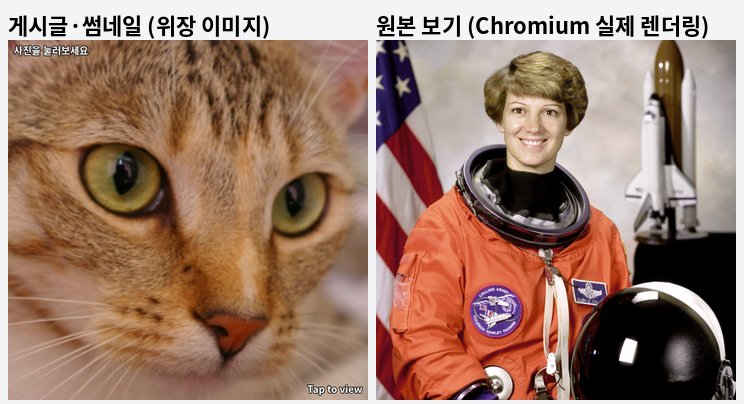

# GammaTrick — 클릭했을 때만 보이는 이미지 생성기 (fork)

게시판 목록이나 본문 썸네일에서는 **하얀 화면**(또는 **다른 사진**)으로 보이다가, 사진을 눌러 **원본으로 보면 숨긴 이미지가 나타나는** PNG를 만드는 도구입니다.

### 👉 [바로 사용하기 — toddoward.github.io/GammaTrick](https://toddoward.github.io/GammaTrick/gamma.html)

페이지 위쪽 탭으로 두 가지 변환을 오갈 수 있습니다.

| 탭 | 게시글·썸네일에서 | 원본으로 볼 때 |
|---|---|---|
| **흰 화면으로 숨기기** (`gamma.html`) | 하얀 화면 + 검은 테두리 | 숨긴 이미지 |
| **다른 이미지로 숨기기** (`cover.html`) | 내가 고른 위장 이미지 | 숨긴 이미지 |

이 레포는 [rhlrtlqm/GammaTrick](https://github.com/rhlrtlqm/GammaTrick)을 fork해서 화질을 개선하고 기능을 더한 버전입니다.
위 링크로 바로 쓰거나, 레포를 내려받아 `gamma.html`을 브라우저로 열어도 됩니다. 설치나 서버는 필요 없습니다.

---

## 원본 레포는 어떻게 동작하나

원본 레포의 핵심은 **PNG 파일 안의 `gAMA` 청크(감마 정보)** 입니다. 디더링은 이 트릭을 가능하게 하는 보조 수단입니다.

1. **픽셀은 거의 흰색으로 저장합니다.** 채널당 `252, 253, 254, 255` 네 값만 씁니다. 사람 눈에는 전부 흰색으로 보입니다.
2. **`gAMA` 청크에 극단적인 감마 값(389 = 0.00389)을 넣습니다.** 이 값을 읽는 브라우저는 저장값을 약 257제곱해서 보여 줍니다. 그래서 252→약 64, 253→102, 254→161, 255→255로 펼쳐지고, 숨긴 그림이 나타납니다.
3. **색이 채널당 4단계(4³ = 64색)뿐이라서 디더링을 합니다.** 원본은 4×4 Bayer 순서 디더링을 썼습니다.
4. **15px 검은 테두리를 두릅니다.** 0은 어떤 감마를 거쳐도 0이라서 테두리는 어느 환경에서나 검정입니다. 흰 배경 게시판에서 "여기에 사진이 있다"는 표시 역할을 하는 것으로 보입니다.

썸네일이 하얀 이유는, 사이트가 썸네일을 만들면서 이미지를 다시 저장할 때 `gAMA` 같은 부가 정보를 버리기 때문입니다. 그러면 거의 흰색인 날것의 픽셀만 남습니다. 원본 보기는 올린 파일을 그대로 보여 주므로 브라우저가 감마를 적용해 그림이 드러납니다.

---

## 이 fork에서 바뀐 점

### 1. 화질 개선

| 방식 | 색 차이 (작을수록 좋음) | 썸네일 잔상 (평균 / 가장 진한 곳) |
|---|---|---|
| 원본 레포 (4단계, Bayer) | 9.6 | 0.65 / 1.03 |
| **호환 (gAMA) 4단계** · 기본값 | **4.0** | 0.56 / 1.01 |
| **고화질 (ICC) 4단계** · 기본값 | **1.4** | 0.30 / 0.80 |
| 고화질 (ICC) 5단계 | 0.9 | 0.38 / 1.02 |
| 고화질 (ICC) 6단계 | 0.6 | 0.47 / 1.28 |

두 기본값 모두 **썸네일 잔상은 원래 방식보다 옅으면서**, 원본으로 볼 때의 화질은 2.4배(호환)에서 7배(고화질) 좋아졌습니다.

측정 방법

- 테스트 이미지 5장(원본 레포의 예시 이미지, scikit-image의 astronaut / coffee / chelsea / rocket)을 긴 변 480px로 줄여 사용했습니다.
- **색 차이**: **S-CIELAB**을 씁니다. 사람 눈의 공간 주파수 민감도로 두 이미지를 먼저 걸러낸 뒤 CIELAB 색차를 재는 방식으로, 디더링 품질 평가에 표준적으로 쓰입니다. 단순 색차와 달리 "평균은 맞지만 알갱이가 거친" 결과에 제대로 벌점을 줍니다.
- **썸네일 잔상**: 색 정보를 무시했을 때의 저장 픽셀을 흐린 뒤, 순백에서 얼마나 어두운지(ΔL\*)를 쟀습니다. 약 1이면 좋은 모니터에서 넓은 면적일 때 겨우 알아챌 정도입니다.
- 결과 PNG를 Chromium에서 실제로 디코딩해, 시뮬레이션 값과 픽셀 단위로 일치하는지(최대 오차 1/255) 확인했습니다.

무엇이 바뀌었나:

- **선형광 오차 확산 디더링.** 눈은 빛의 양(선형광)으로 색을 섞어 봅니다. 그래서 디더링도 선형광 공간에서, 오차 확산(Floyd–Steinberg, 지그재그 순서)으로 합니다. 원본 레포는 감마가 걸린 값으로 계산해서 중간 톤이 밝은 쪽으로 치우쳤습니다.
- **레벨 위치를 다시 잡았습니다.** gAMA 방식은 구조상 레벨 간격이 **코드 공간에서 등비수열**로 고정되고, 자유 변수는 "가장 어두운 레벨을 어디에 두느냐" 하나뿐입니다. 이 값을 32로 잡아 4단계 기준 `32 / 69 / 136 / 255`가 됩니다.
  - 원본 레포는 64에 두어 간격은 좁지만 **검정이 회색으로 떠서** 어두운 사진이 뿌옇게 보였습니다.
  - 더 내리면(15 근처) 검정은 깊어지지만 간격이 2~3배로 벌어져, 피부처럼 넓고 매끈한 면에 **초록·자홍 색 알갱이**가 끼었습니다. 채널마다 따로 디더링하기 때문입니다.
  - 32는 그 사이에서 둘 다 피하는 지점입니다. 실사 사진 3장과 만화 그림 1장을 대상으로 바닥값 16 / 24 / 32 / 48 / 64 × 정렬 디더링(Bayer) / 오차 확산(Floyd–Steinberg)을 1:1 크기로 비교해서 골랐습니다.
- **새 방식: 고화질 (ICC).** `gAMA` 대신 PNG의 `iCCP` 청크에 **3D 색 변환표(A2B0 LUT)가 들어간 ICC 프로필**을 넣습니다.
  - `gAMA`는 채널마다 같은 곡선 하나라서 "R·G·B 각각 4단계" 같은 고정된 색만 만들 수 있습니다.
  - 3D 변환표는 저장값 조합(4단계면 4³ = 64가지)마다 **아무 색이나** 대응시킬 수 있습니다. 그래서 이미지마다 가장 잘 맞는 64색 팔레트를 뽑아(OKLab k-means) 씁니다.
- **썸네일 잔상 줄이기 (고화질 방식).** 많이 쓰이는 색일수록 순백(255,255,255)에 가까운 저장값에 배정해서, 썸네일에 비치는 잔상을 최소화합니다.

### 2. 원본 크기 그대로 테두리 생성 (흰 화면 탭, 고화질 방식 전용)

- 체크하면 이미지를 키우지 않고, **사진 가장자리를 검은 테두리로** 씁니다.
- 썸네일에서는 검은 테두리와 안내 문구가 보이고, 원본으로 보면 **테두리 자리까지 사진이 그대로** 나옵니다. 끄면 예전처럼 테두리를 바깥에 덧붙이므로 원본에서도 검은 테두리가 남습니다.
- **원리:** 테두리 부분의 저장값을 `251~255` 대신 `0~4`(검정)로 내려 둡니다. ICC 입력표가 두 대역을 **같은 색 칸**으로 읽기 때문에, 원본 보기에서는 가장자리도 원래 사진 색으로 나옵니다. Chromium에서 픽셀 단위로 비교했을 때 테두리 자리의 색은 테두리가 없을 때와 최대 1/255만 달랐습니다(반올림 오차).
- 이때 안내 문구는 흑백 두 값으로만 그려서(이진화) **픽셀처럼 각진 글씨**가 됩니다. 글씨 픽셀은 밝은 대역에 그대로 두어, 썸네일에서는 흰 글씨로 보이고 원본 보기에서는 사진 색이 되어 사라집니다.
- 호환(gAMA) 방식은 저장값을 거듭제곱하는 곡선 하나뿐이라, 어두운 저장값을 밝은 색으로 되돌릴 수 없습니다. 그래서 gAMA를 고르면 체크박스가 꺼지고 비활성화됩니다.

### 3. 다른 이미지로 숨기기 (새 탭)

- **숨길 원본 이미지**와 **위장 이미지** 두 장을 넣으면, 게시글에서는 위장 이미지가 보이고 눌러서 원본으로 보면 숨긴 이미지가 나타나는 PNG를 만듭니다.
- **원리:** 저장값을 "위장 이미지 색에 가장 가까우면서, 단계 수로 나눈 나머지가 숨긴 색 번호와 같은 값"으로 고릅니다. ICC 입력표는 0~255 전체에서 이 나머지만 읽도록 톱니 모양으로 만듭니다. 흰 화면 방식은 위장 이미지가 순백인 특수한 경우입니다.
- **품질:** 숨긴 이미지의 화질은 흰 화면 방식과 같습니다. 채도 높은 색조 그라데이션, 원색 체커보드, 사진, 짙은 원색 줄무늬 위장 이미지로 시험했을 때, 원본 보기 결과가 흰 화면 방식과 최대 1/255만 달랐습니다. 위장 이미지는 채널마다 대부분 ±(단계 수의 절반), 0이나 255 끝의 원색에서만 최대 (단계 수-1)만큼 흔들립니다.
- 위장 이미지는 **잘라서 채우기 / 늘려서 채우기 / 전체 보이기(남는 곳은 검정)** 중에 골라 원본 이미지 크기에 맞춥니다. 위장 이미지가 있으므로 테두리는 만들지 않습니다.
- **안내 문구:** 흰 글씨에 **1px 검은 외곽선**을 둘러 위장 이미지 위 어디서든 잘 보이게 했습니다. 문구는 위장 이미지에만 들어가서 원본으로 보면 사라집니다(Chromium 실측: 문구를 넣은 결과와 뺀 결과의 원본 보기가 픽셀 단위로 동일).
- ICC 방식으로만 만들 수 있습니다.

### 4. 테두리 안내 문구 (흰 화면 탭)

- 검은 테두리 **왼쪽 위와 오른쪽 아래**에 작은 흰 글씨를 넣어, 그냥 지나치지 않고 눌러 보게 합니다. 기본 문구는 `사진을 눌러보세요` / `Tap to view`이고, 원하는 문구로 바꿀 수 있습니다.
- 글꼴은 **Noto Sans**(Google Fonts)라서 한글·영어·일본어·중국어·키릴·그리스 문자 등을 쓸 수 있습니다. 글꼴을 불러오지 못하면 기기의 기본 글꼴로 그립니다.
- 체크박스로 문구를 **넣거나 뺄 수** 있습니다. 문구가 켜져 있으면 글씨가 들어가도록 테두리가 조금 두꺼워집니다.
- **"원본으로 볼 때는 문구 숨기기"** (기본 켬): 글씨를 밝은 회색(235)으로 저장합니다. 썸네일에서는 흰 글씨로 보이지만, 원본 보기에서는 검정으로 바뀌어 테두리 속으로 사라집니다. 끄면 원본 보기에서도 흰 글씨가 보입니다.

### 5. 기타

- **PNG를 직접 만듭니다.** 브라우저마다 동작이 다를 수 있는 `canvas.toBlob()` 저장을 거치지 않고 PNG를 직접 조립합니다. 그래서 저장되는 픽셀 값과 들어가는 청크(`gAMA`/`iCCP`)를 정확히 통제할 수 있습니다.
- **결과 확인 화면.** "썸네일에서 보이는 모습"과 "원본으로 볼 때 보이는 모습(이 브라우저가 실제로 그린 결과)"을 나란히 보여 줍니다. 브라우저가 숨김을 풀지 못하면 경고를 띄웁니다.
- 결과 이미지를 우클릭해서 "다른 이름으로 저장"해도 됩니다. 이제 화면의 이미지가 실제 PNG 파일이기 때문입니다.
- **최대 크기.** 기본값은 "원본 크기(느림)"라서 이미지를 줄이지 않습니다. 2048 / 1600 / 1280px를 고르면, 가로·세로 중 긴 쪽이 그 크기를 넘을 때 비율을 유지한 채 줄입니다.
- **큰 이미지도 화면이 멈추지 않습니다.** 변환은 백그라운드(Web Worker)에서 하고, 걸린 시간을 초 단위로 보여 줍니다. 2508×2508 이미지가 약 5초 걸렸습니다(Chromium 기준).
- **다크 🌙 / 라이트 ☀️ 모드.** 오른쪽 위 버튼으로 바꿀 수 있습니다. 처음 들어오면 브라우저/OS의 모양 설정을 따르고, 버튼으로 고른 모드는 다음 방문 때도 기억합니다. 파스텔 그라데이션 배경 위에서도 글자는 높은 대비를 유지합니다.
- **저장되는 파일 이름.** 어떤 설정으로 만들었는지 이름에 붙습니다. 예) `사진_w4_white_hint.png`, `사진_w5_cover.png` (w4 = 4단계, white/cover = 방식, inset = 원본 크기 테두리, hint = 안내 문구, gama = 호환 방식). 게시판 다운로드 주소에는 파일 이름이 그대로 들어가서 `#`나 `&`가 있으면 주소가 잘려 다운로드가 실패하므로, 그런 문자는 미리 지웁니다.
- 붙여넣기(Ctrl+V)와 예시 이미지 버튼을 지원합니다. jQuery는 쓰지 않습니다.

---

## 검토했지만 쓰지 않은 방법

- **16비트 PNG.** 16비트로 저장하면 흰색 근처에 수백 단계를 넣을 수 있어 이론상 거의 무손실입니다. 하지만 Chromium은 **감마를 적용하기 전에 8비트로 줄여 버려서** 결과가 전부 흰색이 됩니다(실측). 그래서 쓰지 않았습니다.
- **단계를 크게 늘리기.** 단계를 늘릴수록 원본 화질은 좋아지지만, 저장값의 범위가 흰색에서 멀어져 썸네일에 회색 잔상이 비칩니다. 게다가 고화질(ICC) 방식은 5단계부터 Windows 사진 앱에서 깨집니다. 그래서 기본값은 4단계로 두었고, 필요하면 화면에서 2~8단계로 바꿀 수 있습니다.

## 자주 묻는 것

**검은 테두리를 청크로 만들 수는 없나요?**

청크만으로 테두리를 **만들어 낼 수는** 없습니다. 하지만 ICC 방식에서는 **사진 가장자리를 테두리로 바꿔 쓸 수는** 있습니다.

- 청크는 이미 있는 픽셀의 색을 다르게 해석하게 할 뿐, 없는 픽셀을 만들지 못합니다. 그리고 테두리가 보여야 하는 썸네일은 청크를 버린 상태라, 테두리는 반드시 **실제로 검은 저장값**이어야 합니다.
- 원래 방식의 테두리는 저장값이 정말 0이라서 썸네일에서도, 감마를 거친 원본 보기에서도 검정입니다. 반면 사진 속 검정은 저장값이 252(거의 흰색)라서, 청크가 사라지면 흰색이 됩니다.
- 그래서 필요한 건 "저장값은 검정인데, 청크가 원래 사진 색으로 읽어 주는 픽셀"입니다. gAMA의 거듭제곱 곡선은 어두운 값을 더 어둡게만 만들어 불가능하고, ICC 입력표는 여러 대역을 같은 색으로 읽게 할 수 있어 가능합니다. 이것이 **원본 크기 그대로 테두리 생성**과 **다른 이미지로 숨기기**의 원리입니다.

덧붙이는 테두리의 비용도 거의 없습니다. 단색이라 거의 압축되고 디더링도 하지 않아서, 560×560 이미지 기준 15px 테두리가 파일을 약 2KB(1.3%) 늘렸고 처리 시간 차이는 측정되지 않았습니다.

## 주의할 점

- 동작 확인은 **Chromium 141**(Chrome·Edge·안드로이드 웹뷰와 같은 엔진)에서만 했습니다. Firefox와 Safari는 검증하지 않았습니다. 결과 화면의 "원본으로 볼 때 보이는 모습"과 경고 문구로 지금 쓰는 브라우저에서 되는지 바로 확인할 수 있습니다.
- 사이트마다 결과가 다를 수 있습니다.
  - 썸네일을 만들 때 색 정보를 반영하는 사이트에서는 썸네일에서도 숨긴 그림이 보입니다. 다른 이미지로 숨기기와 원본 크기 그대로 테두리 생성도 ICC 방식이라 같은 영향을 받습니다. **고화질(ICC) 방식**은 썸네일을 만들 때 ICC 프로필을 반영해 sRGB로 바꾸는 서버 도구가 있어서, `gAMA`보다 이럴 가능성이 조금 더 높습니다. 이럴 때는 **호환(gAMA)** 방식을 써 보세요.
  - 원본까지 다시 압축하는 사이트에서는 원본에서도 하얗게 보입니다.
- **PC 게시판에서는 가로 860px 이상을 권합니다.** 게시판은 표시 폭(DCinside 기준 850px)보다 큰 이미지만 줄여서 싣고, 그때만 이미지에 "원본 보기" 클릭이 붙습니다. 그보다 작으면 원본 그대로 실리는 대신 눌러도 팝업이 열리지 않습니다. 모바일은 크기와 무관하게 열리고, 글 하단 첨부파일 목록으로는 언제나 원본을 받을 수 있습니다.
- **고화질(ICC) 5단계 이상은 일부 뷰어에서 깨집니다.** Windows 사진 앱은 색 변환표가 커지면(4단계 2.9KB 정상 / 5단계 3.4KB부터) 프로필을 잘못 적용해 얼룩덜룩한 거짓 색으로 보여 줍니다. 브라우저(Chromium 계열)와 게시판에서는 5단계 이상도 정상입니다. 기본값을 4단계로 둔 이유입니다.
- 결과 파일을 다른 프로그램에서 편집하거나 다시 저장하면 숨김이 풀리거나 망가질 수 있습니다.

## 파일 구성

| 파일 | 역할 |
|---|---|
| `gamma.html` | "흰 화면으로 숨기기" 화면 |
| `cover.html` | "다른 이미지로 숨기기" 화면 |
| `index.html` | GitHub Pages 첫 주소로 들어오면 `gamma.html`로 보내 주는 페이지 |
| `.nojekyll` | GitHub Pages가 파일을 가공하지 않고 그대로 올리게 하는 표시 |
| `res/gt-core.js` | 인코더 핵심: 팔레트, 디더링, ICC 프로필, PNG 조립. 화면과 무관해서 Web Worker와 Node에서도 돌아갑니다 |
| `res/common.js` | 두 화면이 함께 쓰는 부분: 테마 전환, 이미지 읽기, Web Worker, 글꼴, 결과 표시, 지원 확인 |
| `res/gamma.js` | "흰 화면으로 숨기기" 동작: 옵션, 테두리 문구 |
| `res/cover.js` | "다른 이미지로 숨기기" 동작: 이미지 두 장 입력, 위장 이미지 맞추기, 외곽선 문구 |
| `res/gamma.css` | 스타일 |
| `res/default-image.js`, `img2blob.py` | 예시 이미지 (원본 레포 그대로) |

원본 레포의 `color.js`, `converters.js`, `convert-image.js`, `crc32.js`, jQuery는 `gt-core.js`로 대체되어 삭제했습니다.

## GitHub Pages 켜는 방법 (fork한 사람용)

1. 레포의 **Settings → Pages**로 갑니다.
2. **Build and deployment**의 Source를 **Deploy from a branch**로 두고, Branch를 **`master`**, 폴더를 **`/ (root)`**로 고른 뒤 Save를 누릅니다.
3. 1~2분 뒤 `https://<내 아이디>.github.io/GammaTrick/`에서 열립니다. 이 README 맨 위 링크도 자기 주소로 바꿔 주세요.

## 라이선스

원본 레포와 같은 GNU GPL v3입니다. 원본 저작권은 [rhlrtlqm](https://github.com/rhlrtlqm)에게 있습니다.
